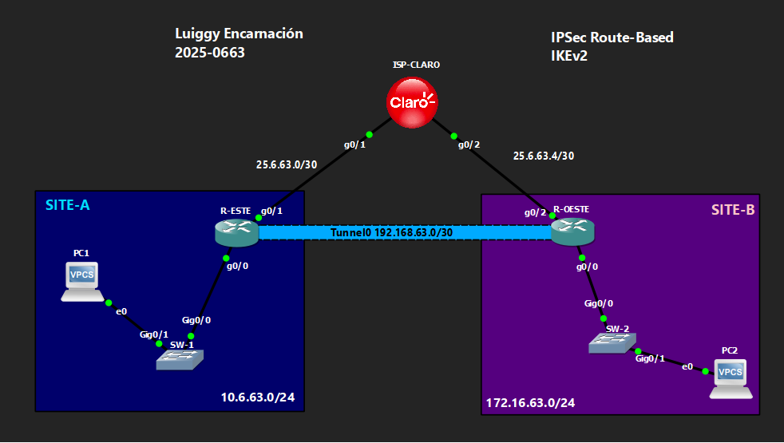

# 🔒 VPN IPSec Route-Based — IKEv2

**Luiggy Habraham Encarnación Cabrera · Matrícula 2025-0663**


-8A2BE2?style=for-the-badge)


> Migración de la VPN Route-Based (VTI) a IKEv2, combinando el perfil IPSec con el perfil IKEv2.

---

## 📑 Tabla de Contenido

1. [Objetivo del Laboratorio](#-objetivo-del-laboratorio)
2. [Parámetros Usados](#-parámetros-usados)
3. [Documentación de la Red](#️-documentación-de-la-red)
4. [Funcionamiento de la VPN](#-funcionamiento-de-la-vpn)
5. [Configuración](#-configuración)
6. [Verificación](#-verificación)
7. [Capturas de Pantalla](#-capturas-de-pantalla)
8. [Video de Demostración](#-video-de-demostración)

---

## 🎯 Objetivo del Laboratorio

Migrar el laboratorio de IPSec Route-Based (VTI) a **IKEv2**, combinando la interfaz `Tunnel0` con `tunnel mode ipsec ipv4` con el marco `crypto ikev2 profile/keyring`. El objetivo es demostrar que el modelo route-based es compatible tanto con IKEv1 como con IKEv2, cambiando únicamente la forma en que se negocia y autentica la Fase 1.

---

## 🧩 Parámetros Usados

| Parámetro | Valor |
|---|---|
| Versión IKE | IKEv2 |
| Cifrado Fase 1 | AES-CBC-256 |
| Integridad Fase 1 | SHA256 |
| Autenticación | Pre-shared key (`Luiggy20250663!`) vía keyring por peer nombrado |
| Grupo DH | 14 |
| Transform-set (Fase 2) | esp-aes 256 / esp-sha-hmac |
| Modo IPSec | Túnel |
| Modelo | Route-based (VTI): `crypto ipsec profile` con `set ikev2-profile` + `tunnel mode ipsec ipv4` |
| Tráfico interesante | No hay ACL; lo decide la tabla de enrutamiento |
| Enrutamiento | Ruta estática hacia Tunnel0 |

---

## 🗺️ Documentación de la Red

### Topología



### Tabla de Direccionamiento

| Dispositivo | Interfaz | IP | Red |
|---|---|---|---|
| ISP-CLARO | g0/1 | 25.6.63.2/30 | Enlace hacia R-ESTE |
| ISP-CLARO | g0/2 | 25.6.63.5/30 | Enlace hacia R-OESTE |
| ISP-CLARO | Lo0 | 20.20.20.20/32 | Loopback de pruebas |
| R-ESTE | g0/1 (WAN) | 25.6.63.1/30 | Hacia ISP |
| R-ESTE | g0/0 (LAN) | 10.6.63.1/24 | SITE-A |
| R-ESTE | Tunnel0 | 192.168.63.1/30 | VTI |
| R-OESTE | g0/2 (WAN) | 25.6.63.6/30 | Hacia ISP |
| R-OESTE | g0/0 (LAN) | 172.16.63.1/24 | SITE-B |
| R-OESTE | Tunnel0 | 192.168.63.2/30 | VTI |

### Detalles del Entorno

| Parámetro | Valor |
|---|---|
| Emulador | GNS3 / Packet Tracer |
| Dispositivos Cisco | IOU / Router IOS |
| VLANs | VLAN 1 (default) en SW-1 y SW-2 |
| Sitios | SITE-A (10.6.63.0/24), SITE-B (172.16.63.0/24) |

---

## 🔬 Funcionamiento de la VPN

**Fase 1 (IKEv2):**
- `crypto ikev2 proposal IKEV2-PROP`: AES-CBC-256, SHA256, grupo DH 14.
- `crypto ikev2 keyring VPN-KEYRING` con PSK por peer nombrado.
- `crypto ikev2 profile VPN-IKE-PROFILE` con `match identity remote address <IP>` exacta.

**Fase 2 (IPSec) — con interfaz de túnel virtual (VTI):**
- `crypto ipsec profile VPN-IPSEC-PROFILE` agrupa el `transform-set` **y** el `ikev2-profile` (a diferencia de IKEv1 donde el profile IPSec solo referenciaba el transform-set).
- `interface Tunnel0` con `tunnel mode ipsec ipv4` y `tunnel protection ipsec profile VPN-IPSEC-PROFILE`.
- El tráfico interesante sigue siendo determinado por la **ruta estática** hacia la red remota, no por una ACL.

**Diferencia clave frente a Route-Based IKEv1:** el perfil IPSec ahora amarra explícitamente qué perfil IKEv2 usar, dando más control cuando un mismo router maneja múltiples túneles VTI.

---

## 🔧 Configuración

Ver archivo: `Configuración para VPN IPSec Route-Based IKEv2.txt`

---

## ✅ Verificación

```
show ip route
show crypto ikev2 sa
show crypto ipsec sa
```

Se espera:
- `show ip route` → ruta estática hacia la LAN remota vía `Tunnel0`.
- `show crypto ikev2 sa` → SA en estado **READY**.
- `show crypto ipsec sa` → contadores de encaps/decaps incrementando.

---

## 📸 Capturas de Pantalla

```
evidencias/
├── 01_topologia.png
├── 02_crypto_ikev2_profile_keyring.png
├── 03_crypto_ipsec_profile_tunnel0.png
├── 04_show_ip_interface_brief.png
├── 05_show_ip_route.png
├── 06_show_crypto_ikev2_sa.png
├── 07_show_crypto_ipsec_sa.png
└── 08_ping_pc1_pc2.png
```

---

## 🎬 Video de Demostración

> 📺 **[Ver demostración en YouTube →](https://youtu.be/XTL4xfhdLcM)**
